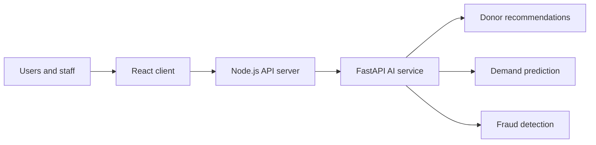

<h1 align="center">Blood Donation Management System</h1>

<p align="center">
  <strong>Connecting donation workflows with practical, data-informed decision support.</strong>
</p>

<p align="center">
  
  
  
  
</p>

A full-stack platform that brings together donor-facing workflows, blood-bank operations, and data-informed decision support. The application pairs a React client and Node.js server with a dedicated FastAPI service for donor recommendations, blood-demand prediction, and fraud detection.

## Architecture



| Component | Technology | Responsibility |
| --- | --- | --- |
| Client | React, Vite | User interface and application flows |
| API server | Node.js | Core application endpoints and service integration |
| AI service | FastAPI, scikit-learn | Recommendations, predictions, and fraud analysis |

## Key capabilities

- Donor and blood-donation management workflows
- ML-assisted donor recommendations
- Blood-demand forecasting from training data
- Fraud-detection checks exposed through the AI service
- Interactive frontend visualisations and responsive UI components

## Project flow

1. Staff and donors use the web interface to manage donation-related workflows.
2. The application server coordinates core requests and service calls.
3. The AI service evaluates the relevant model and returns decision-support output.
4. The interface presents the result as an actionable part of the workflow.

## Run locally

Install dependencies and start each service in a separate terminal.

```bash
# Client
cd client
npm install
npm run dev
```

```bash
# Core API
cd server
npm install
npm run dev
```

```bash
# AI service
cd ai-service
python -m pip install -r requirements.txt
uvicorn app:app --reload
```

The AI API exposes interactive documentation at `http://localhost:8000/docs`. See [ai-service/README.md](ai-service/README.md) for training and health-check commands.

## Repository layout

```text
client/       React/Vite web application
server/       Node.js application server
ai-service/   FastAPI models, training data, and prediction endpoints
```

## Notes

The included datasets and trained-model workflow are intended for project demonstration and development. Validate data quality, model performance, privacy requirements, and clinical/business rules before using the system in a production setting.

## Roadmap

- Add end-to-end test coverage for the user journeys
- Document API contracts and example requests
- Add model-evaluation reports and monitoring guidance
- Prepare a production deployment configuration with secure secret management
