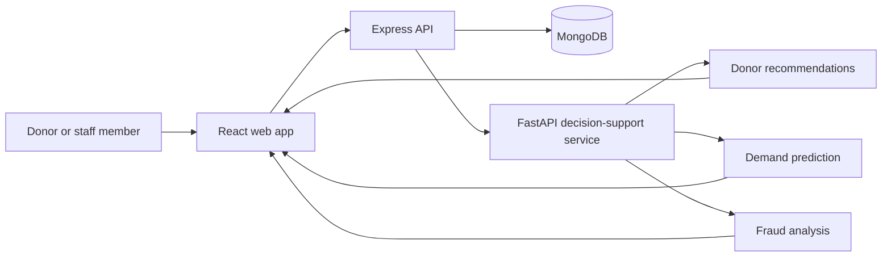

# Blood Donation Management System

> A full-stack donation-management prototype that joins donor workflows, blood-bank operations, and ML-assisted decision support.

<p>
  
  
  
  
</p>

## At a glance

| For | The project provides |
| --- | --- |
| Donors | Registration and donation-oriented web flows |
| Blood-bank staff | Donor, appointment, inventory, emergency-request, and notification modules |
| Operations teams | Recommendation, demand-prediction, and fraud-analysis endpoints |
| Developers | A separated React client, Express API, and FastAPI ML service |

## How it works



The web app handles the user journey. The Express service owns the application's API and data-facing modules; it calls the FastAPI service only when a workflow needs model output. This separation keeps the core application and ML capabilities independently understandable and deployable.

## Main capabilities

- Authenticate users and present donor-focused web flows
- Manage donors, donations, appointments, organisations, inventory, emergency requests, and notifications
- Recommend donors for a request
- Predict blood demand from the included training workflow
- Screen inputs through a fraud-detection model

## Run locally

**Prerequisites:** Node.js, Python 3, and a MongoDB instance.

Start the three services in separate terminals.

```bash
# 1. Web client (usually http://localhost:5173)
cd client
npm install
npm run dev
```

```bash
# 2. Core API (usually http://localhost:5000)
cd server
```

Create `server/.env` with your local MongoDB connection:

```env
MONGODB_URI=mongodb://127.0.0.1:27017/blood-donation
AI_SERVICE_URL=http://localhost:8000
```

```bash
npm install
npm run dev
```

```bash
# 3. ML service (http://localhost:8000)
cd ai-service
python -m pip install -r requirements.txt
uvicorn app:app --reload
```

Visit `http://localhost:8000/docs` for the ML service's interactive API documentation. The Express health check is available at `http://localhost:5000/health`.

## Repository guide

```text
client/       React + Vite interface, routes, pages, and components
server/       Express API and domain modules
ai-service/   FastAPI routers, models, training scripts, and datasets
```

| Area | Start here |
| --- | --- |
| Web routes | `client/src/routes/index.jsx` |
| API composition | `server/app.js` |
| Business modules | `server/modules/` |
| ML API | `ai-service/app.py` |
| Model training | `ai-service/train_all_models.py` |

## Development note

The datasets and models are included for demonstration and development. Before any real-world or clinical use, validate model performance, data governance, privacy controls, security, and the applicable medical and operational policies.

## Next steps

- Add end-to-end tests for the principal donor and staff journeys
- Publish API examples and model-evaluation reports
- Add deployment configuration and secure secret management for each service
